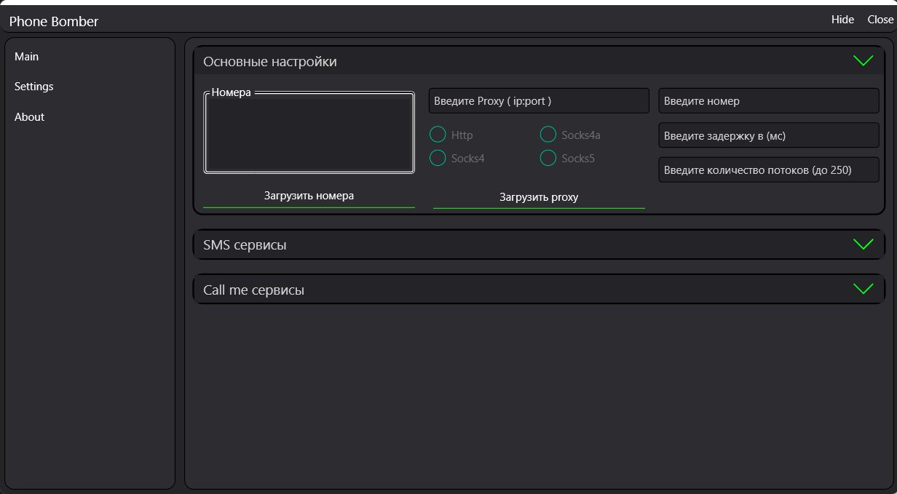

# SMS BOMBER
---
___Описание___

Данное приложение является тем же pet проектом, который я разработал для повышения навыков в разработке на языке программирования c#, а так же для освоения базовых навыков работы с WPF (Windows Presentation Foundation)

___Возможности___
* Спам на номер различными "SMS" сервисами (9 сервисов)
* Спам на номер различными "Call me" сервисами (6 сервисов)
* Спам сразу на несколько номеров (Возможно подгрузить номера из файла)
* Возможность установить Proxy сервер (так же возможно загрузить несколько серверов из файла). Поддерживаются HTTP, Socks4, Socks4a, Socks5
* Возможность использовать несколько потоков
* Возможность устанавливать интервал спама
* Отображение статистики
---
___Скриншоты___

 
Главное окно 
 
Основные настройки 
 
Доступные сервисы 